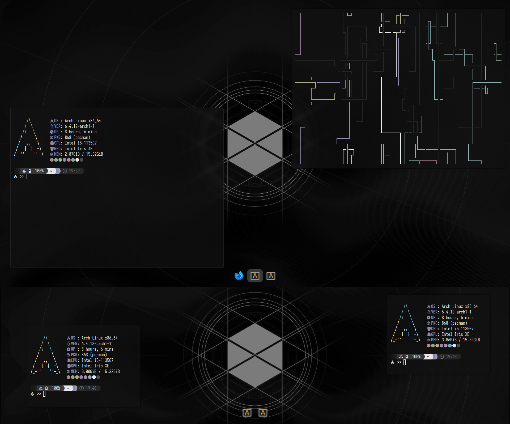
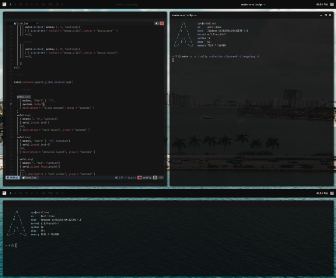
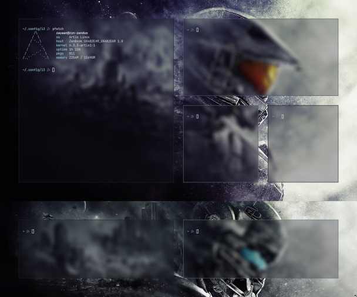
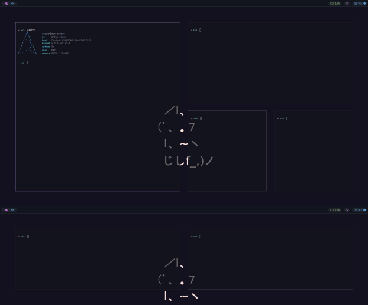
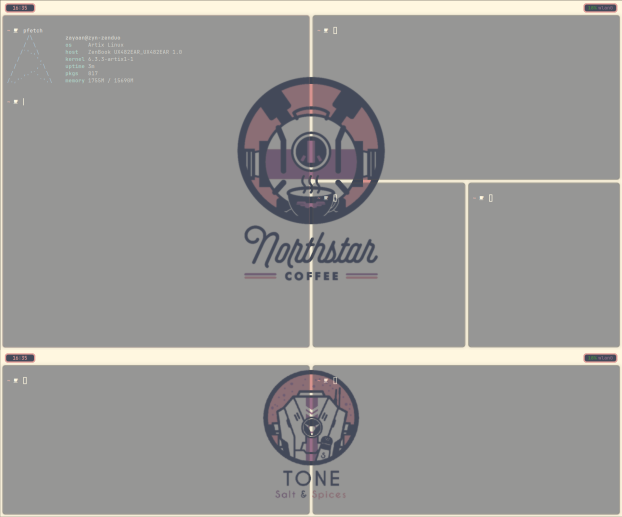

# Dotfiles

> **Note:** 
> I have now moved to NixOS so these dots are unmaintained but will probably still work. 
> Nixdots: 

#### Info
- An archive of all of my various dotfiles
- Configured for my system, chances are stuff will break
- in reverse chronological order

#### Mountain -  Hyprland

#### Paradise - AwesomeWM

#### Nord - i3wm

#### Catpuccin - SwayWM

#### Northstar - Hyprland

### Credits

Paradise dotfiles are initially based on https://github.com/Stardust-kyun/dotfiles, thanks for the well organised config
